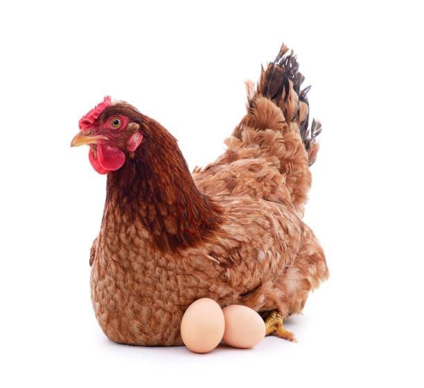

# Dave Farm 🐔

Dave Farm is a professional, **offline-first** poultry farm management application built with Flutter. It helps farmers track daily egg production, sales, expenses, and flock health with ease, even in areas with limited internet connectivity.

## ✨ Key Features

- **Offline-First Architecture**: Log data anytime, anywhere. Sync with the cloud when you have a connection.
- **Comprehensive Tracking**:
    - **Daily Logs**: Monitor good, broken, and damaged eggs, plus mortality rates.
    - **Inventory Management**: Track feed consumption and medicine usage.
    - **Finances**: Log egg sales and farm expenses (Vaccines, Vitamins, Feed, etc.).
- **Rich Analytics**: Visual charts for production trends and net profit summaries.
- **Multilingual Support**: Available in **English**, **Amharic**, and **Oromo**.
- **Secure Access**: PIN-based local lock and JWT-based cloud authentication.

## 🛠 Tech Stack

- **Mobile**: Flutter (Dart)
- **Local DB**: SQLite (via `sqflite`)
- **Backend**: FastAPI (Python)
- **Database**: PostgreSQL (via SQLAlchemy & AsyncPG)
- **State Management**: Listenable/ChangeNotifier (Settings)

## 🚀 Getting Started

### Prerequisites
- Flutter SDK (^3.11.0)
- Python (3.9+)
- PostgreSQL (Local or Cloud)

### Mobile Setup
1. Clone the repository.
2. Run `flutter pub get`.
3. Update `lib/core/config/app_config.dart` with your Backend URL.
4. Run `flutter run`.

### Backend Setup
1. Navigate to the `backend/` directory.
2. Create a virtual environment: `python -m venv venv`.
3. Install dependencies: `pip install -r requirements.txt`.
4. Configure `.env` with your `DATABASE_URL`.
5. Run the server: `uvicorn app.main:app --reload`.

## 📄 License
This project is for private use by Dave Farm.
